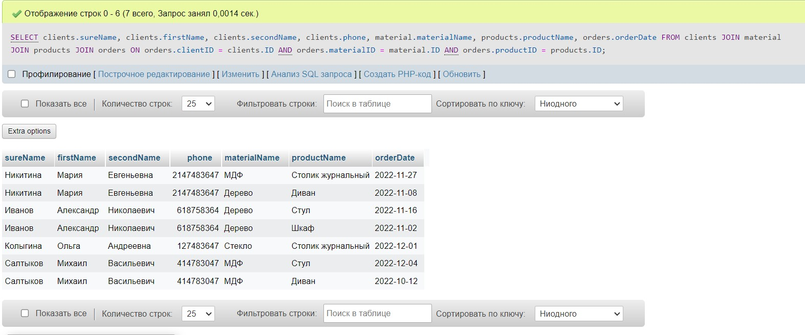

Необходимо создать общую таблицу с заказами для интернет -магазина под названием “orders” она должна включать в себя три поля: 
clientID productID materialI
Dданную таблицу нужно связать с таблицей клиентов “clients” которую также нужно создать, внутри данной таблицы в 
отдельных полях должны храниться ФИО клиентов, номер телефона, далее создаем и подключаем таблицу продуктов “products” 
содержащую поле ID и название продукта, и последней таблицей которую потребуется создать и подключить будет содержать 
название материала, назовем ее “material”, она включать в себя поле ID и поле с названием материала. Обратите внимание на то, 
что поле ID это всегда тип данных int, остальные поля с типом данных var char, длину символов можете установить 256, в конечном итоге, 
структура базы данных в инструменте “дизайнер” от phpMyAdmin будет иметь подобный вид: Заполните данные таблицы тестовыми данными, 
необходимо внести не менее трех любых уникальных записей в каждую из таблиц соблюдая при этом правильную структуру базы данных.

Необходимо выполнить SQL запрос к нашей базе данных при котором информация о заказах будет представлена в виде: 
ФИО покупателя, номер телефона, наименование материала, наименование продукта, дату заказа

Запрос представлен в картинке:

